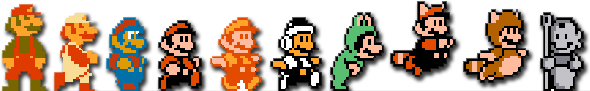

## testing script 1 

 Fri Jan 25 23:58:07 GMT 2019 
 

   post

  

---------

## testing git commit

 Sat Jan 26 00:05:31 GMT 2019 

   if successful this should get committed and pushed to the remote
   

  

---------

## testing the blog script when files staged

 Sat Jan 26 00:13:23 GMT 2019 

   this test shuold add the entry to the blog file but it should fail to commit because other files are staged

  

---------

### Back to work

 Sat Jan 26 00:29:36 GMT 2019 

   Today finally I found some time to work on this project. I've been too busy with exams and work. It nearly feels as if I am starting from the scratch, but it's good to be back at it. I had put a lot of thought into the design over this break period. I have a pretty good image in my head about the internal modules in the application. I had spent some significant time already on researching the NLP sentiment analysis software and there will be issues finding the right model and some open source package which would allow me to twick the algorithm if it will be required.
   
   This is why, I decided to start of with development of other modules first and leave the sentiment analysis one for later. I am going to start looking into NEWS and FINANCE services now. Building interfaces first and hooking them up to the Main program.

  

---------

## write-blog script test

 Sat Jan 26 00:41:30 GMT 2019 
 

   fixed the style

  

---------

## UI - the beginning and future plans

 Tue Mar  5 05:02:26 GMT 2019 

   Today I've implemented first prototype of the UI interface. I am trying to keep it as simple as possible. For now I am not implementing any semantic checks such as data type chekcs, correct input dates or interval times to not be a negative number. This are trivial stuff and are time consuming. This UI for demonstration purposes should be suifficient. The product is not planned to be released to general public nor in a production environemnt. I'd like start working on implementation of machine learning and sentiment analysis of the project as this is what will take the most time to implement in proper way.

  

-----

## NEWS API - not providing full content

 Wed Mar  6 14:32:44 GMT 2019 

   So I've discovered yesterday that there is no news service / API which would provide full content of articles. The API returns only some portion of articles, the content is limited to 260 words and rest of it is cut off. This would make sense, realistically, it's illegal to distribut someones content without their permission. The search of relevant articles to the topic still works, and there is an URL provided to the original article and its publisher web site. I am thinking of limiting the source of articles (publishers) to only three (top four) out of 138+ available and will develop the scraper for this particular websites to be able to retrieve the content. This is a huge constraint on my project, because I was anticipating over 100 article per 3 days about a company, now this number will be between 10-20.

  

-----

## HTML scraper for articles - pattern finding

 Wed Mar  6 14:45:15 GMT 2019 

   I was able to indentify HTML patterns of publishers such as CNN and The New York Times. With proper crawling tools available in Java I should be able to develop website scraping objects for these. This adds addtional functionality of the project which have direct impact on required work to be done...

  

-----

## Feels good to be back.

 Sun Apr 14 04:53:00 IST 2019 

   I finally had some to work on this project. I finished with other school assignments and was able to put work aside which enabled me to work on Skanner. I had to completely remind myself how javaFX works and how my code is even structured.

  

-----

## Do I have enough of time?

 Sun Apr 14 05:03:39 IST 2019 

   I was considering, perhaps I still am, to migrate my whole project to Python. I've developed more complex applications in python than I did in Java. I feel it would be easier to develop this in Python, Java is just more technical language and less forgiving. I am able to deliver this in Java, but the question is, if only on time? It's just more difficult to write a bad Java program than a good Python program ;D

  

-----

## There is a reason why I never liked front end

 Sun Apr 14 05:17:12 IST 2019 

   It's a pity they put so much emphasis on UI at Uni.. We all know it's the logic and the back-end is what's important and should be focues on. JavaFX and I don't really like each other, I feel. I considered switching to a WEB Framework and make the UI using HTML/CSS/JS, but eventually I decided it would be a trap. I know for the fact that in Web development I would start dockerizing the project, thinking about automating the deployment and configuring the service on the cloud. Don't get me wrong, this is all cool, I've done thid before on numerous occasions, but it is a time consuming job, the time which I don't really have, therefore, at the end I decided to stick with javaFX. Things got easier after I refactored the code and modelled the application better. Following Model Controller View design pattern and sticking it its characteristics helps a lot here! 

  

-----

